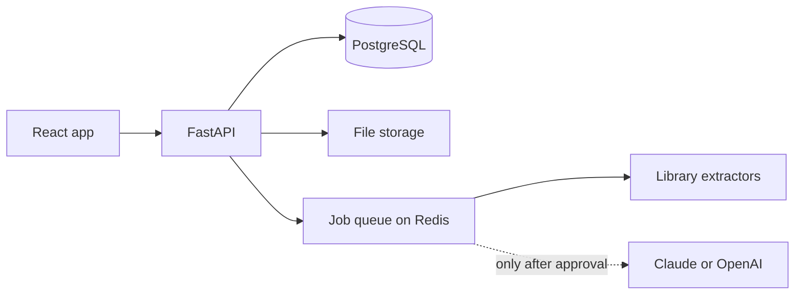
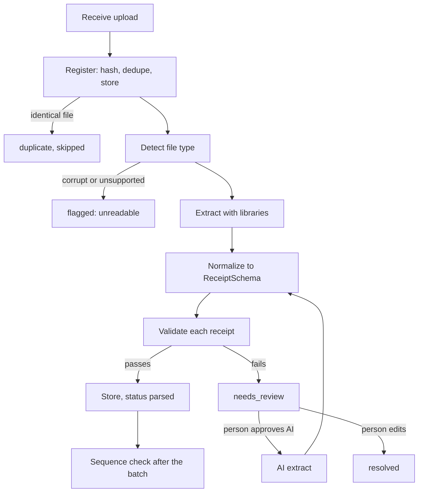

# Parchi: Implementation Plan

Build this in seven phases, each ending in something that runs end to end. Extraction uses libraries by default and calls AI only after a person approves it.

## Decisions made

| Topic | Decision |
| --- | --- |
| Sequence checks | One running series of printed receipt numbers. Split into prefix and integer, check gaps per prefix. A receipt with no readable number skips the gap check. |
| Reference numbers | Every file gets `REF-YYYY-NNNNNN` at registration, from one database sequence. Receipts get `-01`, `-02` suffixes. Used for identification, not gap detection. |
| Currency | Rupees (INR) only. No currency column, no conversion. |
| Volume | Thousands of receipts a month, so PostgreSQL, Redis and an ARQ worker from phase 1. |
| AI | Opt-in per file or per batch. Off by default. Approval is enforced on the server and recorded. |
| Accent color | Violet for actions. Green only for success. |
| Frontend | React and Vite (Streamlit was rejected). |
| Design | Theme C: dark palette with a left sidebar. See `docs/design/`. |

## Scope

Version 1 takes Excel, CSV, PDF and image receipts, extracts them with libraries, validates them, stores them, and lets a person review and query the results. AI extraction runs only when a person approves it.

In scope for v1:

- Upload, duplicate detection, and a status page showing every file
- Library extraction for Excel and CSV, digital PDFs, scanned PDFs and images (OCR)
- Validation: required fields, line items adding up, sequence gaps, out-of-order dates, duplicates
- A review page with manual editing and opt-in AI extraction (Claude or OpenAI) per file or per batch
- A query page with filters, then plain-English questions in the last phase
- Structured logging, and an audit trail of every AI approval

Left for later:

- Login and user roles
- Cloud deployment and S3 storage
- Excel templates learned per vendor
- Exports beyond CSV

## Architecture and stack

A FastAPI backend does all the work, and the React app is only a client of its API. Two rules keep every part swappable: the frontend talks to the backend only over HTTP, and every extractor returns the same `ReceiptSchema`.



| Layer | Tools | Notes |
| --- | --- | --- |
| App | React, TypeScript, Vite | Single-page app, no second server |
| UI | Tailwind, shadcn/ui, lucide-react | Dark palette with the sidebar layout (Theme C) |
| Fonts | Space Grotesk, DM Sans, JetBrains Mono | Headings, body, file names and numbers |
| Client data | TanStack Query and Table, React Router, React Hook Form, Zod, react-dropzone | Polling, tables, routing, forms, uploads |
| API types | openapi-typescript | Generated from FastAPI's spec, so the two cannot drift |
| API | FastAPI, Pydantic v2, python-multipart | Validation and generated docs |
| Database | SQLAlchemy 2, Alembic | PostgreSQL from the start, since several workers write at once |
| Jobs | ARQ workers with Redis | Thousands of files a month need workers that survive restarts |
| Extraction | pandas, openpyxl, pdfplumber, PyMuPDF, Tesseract or PaddleOCR | Needs no API keys |
| AI | anthropic and openai SDKs behind one interface | Runs only after a person approves |
| Reliability | tenacity, structlog | Retries with backoff, structured logs |
| Tooling | uv, ruff, pytest, ESLint, Prettier, Vitest, Docker Compose | Local setup and checks |

## Repository layout

```
parchi/
├── docker-compose.yml
├── .env.example
├── docs/                    PLAN.md and design/
├── data/                    gitignored: uploads/ and samples/
├── backend/
│   ├── pyproject.toml
│   ├── alembic.ini, migrations/
│   ├── src/parchi/
│   │   ├── config.py        settings from the environment
│   │   ├── logging.py       structlog setup
│   │   ├── db/              session.py, models.py, repositories.py
│   │   ├── schemas/         receipt.py (ReceiptSchema), api.py
│   │   ├── ingestion/       receiver, registry, storage, detector, batches, recovery
│   │   ├── extraction/      router, excel, pdf_text, pdf_scan, image, preprocess, llm/
│   │   ├── validation/      arithmetic, sequence, duplicates, runner
│   │   ├── pipeline/        orchestrator.py, tasks.py
│   │   ├── query/           filters.py, text_to_sql.py
│   │   ├── worker.py        ARQ worker settings
│   │   └── api/             main.py, middleware.py, routes/
│   └── tests/               unit/, integration/, fixtures/
├── frontend/
│   └── src/                 api/, components/, pages/, styles/, main.tsx
└── scripts/                 benchmark_extractors.py, reprocess_failed.py
```

## Data model

Six tables hold everything. Files and receipts are separate, and every extraction attempt is kept as its own row, so a re-run never overwrites an earlier result.

| Table | Key columns | Purpose |
| --- | --- | --- |
| `upload_batches` | id, created_at | Groups the files from one upload |
| `files` | id, ref_no (unique), original_name, sha256 (unique), size_bytes, mime_type, kind, storage_path, batch_id, status, error, uploaded_at | One row per uploaded file |
| `extraction_runs` | id, file_id, parser, provider, result_json, confidence, duration_ms, ai_approved_by, ai_approved_at, accepted, error | Every attempt, including who approved an AI call and when |
| `receipts` | id, ref_no, file_id, run_id, vendor, receipt_number, receipt_date, subtotal, tax, total, category, confidence | The accepted, normalized result |
| `line_items` | receipt_id, description, quantity, unit_price, amount | Items on a receipt |
| `flags` | id, file_id, receipt_id, type, severity, detail, resolved, resolved_by, resolved_at | Problems a person must look at |

One file can produce several receipts, such as a multi-sheet Excel file. Money is stored as decimals, never floats, and every amount is in rupees (INR).

**Reference numbers.** Registration gives every file a reference such as `REF-2026-000412`, drawn from one database sequence, so the file is identifiable from its first log line. Receipts extracted from it get `REF-2026-000412-01`, `-02` and so on. The reference is separate from the printed receipt number. It cannot reveal a missing paper receipt, so gap checks still use the printed number, and a receipt with no readable number skips that check.

**File statuses**

| Status | Meaning |
| --- | --- |
| `pending` | Registered, waiting for a worker |
| `processing` | Library extraction or validation is running |
| `parsed` | Extracted and every check passed |
| `needs_review` | The library result failed checks. Waiting for a person to edit, approve AI, or reject |
| `ai_processing` | A person approved AI and the call is running |
| `flagged` | AI also failed, or the two results disagree |
| `resolved` | A person fixed it or accepted a result |
| `rejected` | Not a receipt, or a bad scan |
| `duplicate` | Identical bytes to an earlier file, skipped |
| `failed` | A system error, retried automatically |

**Flag types:** `unreadable`, `validation_failed`, `parser_conflict`, `sequence_gap`, `out_of_order`, `duplicate_receipt`, `arithmetic_mismatch`.

## Ingestion pipeline

Every file passes the same stages in order, and each stage writes a status and a log line. Nothing before the AI step calls an LLM.



| # | Stage | What it does | On failure |
| --- | --- | --- | --- |
| 1 | Receive | Checks size and count limits, streams the upload to a temp file | Rejected with a clear error |
| 2 | Register | Computes SHA-256, looks for an identical file, stores the file under its hash, assigns its reference number, creates the `files` row | An identical hash marks the upload `duplicate` and stops |
| 3 | Detect | Identifies the type from the file's bytes, not its extension | Corrupt or unsupported files are flagged `unreadable` at once |
| 4 | Extract | The router picks the library extractor for that type and records an `extraction_runs` row | An error or empty result sends the file to `needs_review` |
| 5 | Normalize | Maps output to `ReceiptSchema`: parses dates, strips currency symbols, converts numbers to decimals | An unparseable field is left empty and lowers the confidence |
| 6 | Validate | Required fields present, line items add up, date is plausible | Any failure leaves the file in `needs_review` |
| 7 | Store | One transaction writes the receipt, its line items and the run, then sets `parsed` | Roll back, mark `failed`, log the error |
| 8 | Sequence check | Cross-receipt rules on the single running series: gaps, out-of-order numbers, duplicate vendor, number and total | Writes rows to `flags` |

**Register in detail.** Compute the SHA-256 while streaming. If the hash exists, record the upload as `duplicate` pointing to the original and stop. Otherwise store the bytes under `uploads/<first two hash chars>/<hash>.<ext>`, then insert the `files` row. If the insert fails on the unique hash (a simultaneous identical upload), delete the stored file and report a duplicate. If any later step fails, delete the stored file so there are no orphans. It never reads the file's contents and never decides whether it is a receipt.

**Handling each file type**

| Type | Detected by | Extraction path | Notes |
| --- | --- | --- | --- |
| Excel and CSV | File signature, then sheet structure | pandas and openpyxl with a column mapping | Several sheets are possible, and one sheet can hold many receipts |
| Digital PDF | Real text found on the pages | pdfplumber tables, then text with rules | One PDF may hold several receipts, split by page |
| Scanned PDF | Page images and little text | Render each page, then OCR | Auto-rotate and de-skew first |
| Image | JPG, PNG, WebP, HEIC | Fix orientation, convert HEIC, then OCR | The type most likely to need AI |
| Corrupt or password-protected | Fails to open | None | Flagged `unreadable`, never retried |

Each type is one class registered with the router:

```python
class Extractor(Protocol):
    handles: set[FileKind]
    def extract(self, path: Path, ctx: JobContext) -> list[ReceiptSchema]: ...
```

Each type has its own confidence threshold and fallback chain in one settings table (for example, images go to `needs_review` sooner than Excel files).

**AI runs only with approval**

- No code path calls an LLM unless the request carries an explicit approval. A checkbox in the UI is not enough, so the server enforces it.
- An `AI_ENABLED` setting, off by default, disables all AI calls even for direct API requests.
- Each approval is stored on the run: who approved, when, and which provider.
- The confirmation dialog states that the file or its text will be sent to the named provider.
- Results are cached by file hash and provider, and a daily cap limits calls.
- AI re-enters the pipeline at stage 4 with `force_parser`, then runs stages 5 and 6 as normal.

**Rules that keep it safe to re-run**

- Sequence checks run after a batch finishes, and again when a file is resolved. Only `parsed` and `resolved` files take part, so a missing file does not cause false gaps.
- Every stage is idempotent. A unique constraint on `sha256`, plus one library run per file, stops a retry from creating duplicate receipts.
- Timeouts and rate limits retry two or three times with backoff. A corrupt file is never retried.
- A recovery job re-queues files stuck in `processing` past a timeout.

## API

The frontend calls these endpoints and nothing else. Files are always addressed by id or reference number, never by storage path, and the AI endpoint refuses any request without an approval.

| Method and path | Purpose | Used by |
| --- | --- | --- |
| `POST /batches` | Upload one or more files, returns the batch and a result per file (new or duplicate) | Upload |
| `GET /batches/{id}` | Progress of every file in a batch | Upload |
| `GET /files` | List files, filterable by status, searchable by name or reference, paginated | Files |
| `GET /files/summary` | Counts per status for the summary cards and sidebar badges | Files |
| `GET /files/{id}` | One file, by id or reference number, with its runs, flags and receipts | Review |
| `GET /files/{id}/download` | The original file | Files, Review |
| `GET /files/{id}/error-report` | Reference number, flags, run results and failed checks, generated on demand | Files |
| `GET /files/error-reports.zip` | Originals and one combined report for all flagged files | Files |
| `PUT /files/{id}/receipt` | Save manual edits as a `manual` run and resolve the file | Review |
| `POST /files/{id}/ai-extract` | Run AI. Body needs `provider` and `approved: true`. Also accepts a list of file ids for batch approval | Review, Files |
| `POST /files/{id}/reject` | Mark not a receipt or a bad scan | Review |
| `GET /receipts` | Filter by date, vendor, amount, category, status | Query |
| `POST /query/ask` | Plain-English question, returns the interpretation, the SQL that ran and the rows | Query |
| `GET /ai/usage` | AI calls approved today and the daily cap | Sidebar |
| `GET /health` | Liveness check | Deployment |

Errors use one shape, `{code, message, request_id}`, so the frontend can show the message and the log can be found by id.

## Frontend

Four pages in a dark theme with a left sidebar (Theme C in `docs/design/`). Build against a mock API first, then switch to the real one.

| Page | Shows | API calls | Behavior |
| --- | --- | --- | --- |
| Upload | Drop zone, per-file progress for the batch, a short explainer of the pipeline | `POST /batches`, `GET /batches/{id}` | Polls while files process, marks duplicates, links to Files |
| Files | Summary cards, status chips, search, file list with reference numbers and download buttons | `GET /files`, `/files/summary`, `/download`, `/error-report` | Refreshes every 5 seconds while anything is processing, and lets a person select several `needs_review` files for one AI approval |
| Review | Original file and its reference number, library and AI results side by side, editable final values, line items | `GET /files/{id}`, `PUT /receipt`, `POST /ai-extract`, `POST /reject` | Highlights differing fields, and shows a confirmation dialog before any AI call |
| Query | Question box, filters, summary tiles, results table with reference numbers | `GET /receipts`, `POST /query/ask` | Shows how the question was read and the SQL that ran, and notes that flagged files are excluded |

Design tokens (Tailwind theme): ground `#0B1210`, sidebar `#0F1815`, card `#121C18`, border `#1F2E28`, text `#EAF2EE`, muted `#9DB0A7`, accent `#8B7CF6` for actions only, success `#3DDC97`, needs review `#FFC766`, flagged `#FF9C8A`.

Design status: Theme C shows the `Needs review` status, batch selection on the Files page, the AI approval dialogs (one file and a batch), reference numbers, and the violet accent.

```
frontend/src/
  api/          generated client and query hooks
  components/   StatusBadge, SummaryCard, FileRow, AiConfirmDialog
  pages/        Upload, Files, Review, Query
  styles/       design tokens
  main.tsx
```

## Roadmap

Seven phases, about 12 weeks in total. Do not start a phase until the previous exit check passes. The estimates assume one developer working part-time, so treat them as rough.

| Phase | Build | Exit check | Estimate |
| --- | --- | --- | --- |
| 1. Foundation | Repo, uv and Vite setup, Docker Compose with PostgreSQL and Redis, settings, logging and request ids, database models and the first Alembic migration, `/health` | `docker compose up` runs the API, PostgreSQL, Redis and an empty app, and the migration creates every table | 1 week |
| 2. Upload and register | Receiver, registry (hash, dedupe, storage, reference numbers), batches, Upload page, basic Files list with downloads | Uploading the same file twice gives one file and one `duplicate` | 1.5 weeks |
| 3. Library extraction | Detector, router, Excel and digital PDF extractors, normalizer, orchestrator, status updates, an ARQ worker on Redis | Sample Excel and text-PDF receipts finish as `parsed` with the right totals | 2 weeks |
| 4. Validation and review | Arithmetic, required-field, sequence and duplicate rules, flags, `needs_review`, Review page with manual edit, error report download, summary cards | A broken sample lands in `needs_review`, is fixed by hand and becomes `resolved`, and a sequence gap is flagged | 2 weeks |
| 5. OCR and images | Scanned PDF and image extractors, preprocessing, HEIC conversion | A benchmark on the sample photos reports field accuracy, and poor results go to `needs_review` | 1.5 weeks |
| 6. Opt-in AI | Provider interface, Claude and OpenAI adapters, approval enforcement, `AI_ENABLED`, daily cap, cache, confirmation dialog, batch approval, comparison view, benchmark script | A test proves no AI call happens without approval, and an approved run records who approved it | 2 weeks |
| 7. Query and hardening | Receipts filters, plain-English query on a read-only database role, recovery job, integration tests, setup docs | The fuel-in-August example returns the right rows, and the full test suite passes | 2 weeks |

Start now, in phase 1: collect 30 to 50 real receipts covering every file type, including the ugly ones, and write down the correct fields for each. The tests in phases 3 to 6 all depend on them.

## Testing, logging and deployment

**Testing**

- Unit tests for each validation rule, the detector, every extractor and the normalizer (pytest), and for key components on the frontend (Vitest)
- Integration tests that run the whole pipeline on `data/samples/` for every file type, including broken files: corrupt, password-protected and empty
- An approval test that proves the orchestrator raises without approval and that no AI adapter is called, using a mock
- A benchmark script that scores each extractor and AI provider against hand-labeled answers, run before changing a parser or prompt
- CI on every push: ruff, pytest, ESLint and Vitest

**Logging**

- structlog writes JSON in production and readable output in development, to the console and a rotating file
- `request_id`, `file_id` and `run_id` are attached to every line, along with the reference number, so one search shows a file's whole story
- Each stage logs its result and duration, and each AI call logs provider, model, token counts, latency and retries
- Receipt text, extracted values and API keys are never logged. Log ids and field names only
- The error report includes the `run_id`, so a reviewer can find the matching log lines

**Deployment**

Docker Compose runs the API, an ARQ worker, the frontend, PostgreSQL and Redis. Back up the database and the uploads folder together.

| Setting | Default | Purpose |
| --- | --- | --- |
| `DATABASE_URL` | `postgresql://localhost/parchi` | Connection string for PostgreSQL |
| `REDIS_URL` | `redis://localhost:6379` | Job queue |
| `STORAGE_DIR` | `data/uploads` | Where original files are kept |
| `AI_ENABLED` | `false` | Master switch for every AI call |
| `AI_DAILY_CAP` | `50` | Approved AI extractions allowed per day |
| `ANTHROPIC_API_KEY`, `OPENAI_API_KEY` | none | Set only the providers you use |
| `LOG_LEVEL` | `info` | Verbosity |

## Risks

| Risk | Why it matters | Mitigation |
| --- | --- | --- |
| Poor OCR on crumpled photos | Most image receipts may fail library extraction | Preprocess images, send failures to `needs_review`, offer opt-in AI, benchmark early |
| Misread digits | A wrong total can look plausible | Line-item arithmetic check, confidence shown, a person confirms flagged files |
| Receipts sent to an AI provider | Financial data leaves the machine | Opt-in per file, `AI_ENABLED` off by default, approval audit trail, review the provider's data retention terms |
| Duplicate or simultaneous uploads | Duplicate receipts and wrong totals | Unique `sha256`, idempotent stages |
| Jobs stuck after a crash | Files stay in `processing` forever | Status written before and after each stage, plus a recovery job |
| AI cost | Approvals add up | Daily cap and a cache by file hash and provider |
| Scope creep | 12 weeks becomes 20 | Exit checks per phase and the "Left for later" list |
